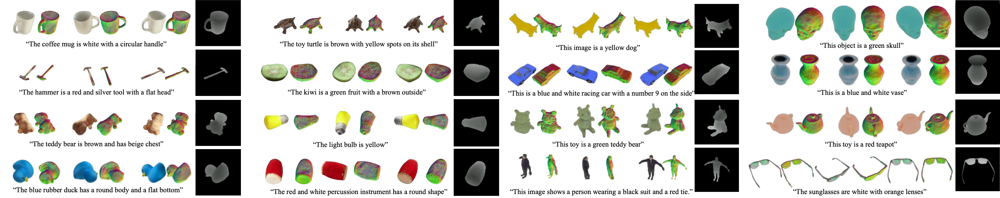

3D VADER - AutoDecoding Latent 3D Diffusion Models
==================================================
  

[Evangelos Ntavelis](http://www.entavelis.com)<sup>1\*</sup>, [Aliaksandr Siarohin](https://aliaksandrsiarohin.github.io/aliaksandr-siarohin-website/)<sup>2</sup>, [Kyle Olszewski](https://kyleolsz.github.io/)<sup>2</sup>, [Chaoyang Wang](https://mightychaos.github.io)<sup>3</sup>, [Luc Van Gool](https://ee.ethz.ch/de/departement/professoren/professoren-kontaktdetails/person-detail.OTAyMzM=.TGlzdC80MTEsMTA1ODA0MjU5.html)<sup>1,4</sup>, [Sergey Tulyakov](http://www.stulyakov.com/)<sup>2</sup>


<sup>1</sup>Computer Vision Lab - ETH Zurich <sup>2</sup>Snap Inc. <sup>3</sup>CI2CV Lab - CMU <sup>4</sup>ESAT - KULeuven

\*Work done while interning at Snap.

[Project Page](https://snap-research.github.io/3DVADER/) - [arXiv](https://arxiv.org/abs/2307.05445) - [Paper](https://snap-research.github.io/3DVADER/paper.pdf) - [Cite](#bibtex)

**TL;DR**  
We generate 3D assets from diverse 2D multi-view datasets by training a **3**D **D**iffusion model on the intermediate features of a **V**olumetric **A**uto**D**ecod**ER**.

Abstract
--------



We present a novel approach to the generation of static and articulated 3D assets that has a 3D _autodecoder_ at its core. The 3D _autodecoder_ framework embeds properties learned from the target dataset in the latent space, which can then be decoded into a volumetric representation for rendering view-consistent appearance and geometry. We then identify the appropriate intermediate volumetric latent space, and introduce robust normalization and de-normalization operations to learn a 3D diffusion from 2D images or monocular videos of rigid or articulated objects. Our approach is flexible enough to use either existing camera supervision or no camera information at all -- instead efficiently learning it during training. Our evaluations demonstrate that our generation results outperform state-of-the-art alternatives on various benchmark datasets and metrics, including multi-view image datasets of synthetic objects, real in-the-wild videos of moving people, and a large-scale, real video dataset of static objects.

Method
------


  

Our proposed two-stage framework: Stage 1 trains an autodecoder with two generative components, G1 and G2. It learns to assign each training set object a 1D embedding that is processed by G1 into a latent volumetric space. G2 decodes these volumes into larger radiance volumes suitable for rendering. Note that we are using only 2D supervision to train the autodecoder. In Stage 2, the autodecoder parameters are frozen. Latent volumes generated by G1 are then used to train the 3D denoising diffusion process. At inference time, G1 is not used, as the generated volume is randomly sampled, denoised, and then decoded by G2 for rendering.


3D Assets Visualization
-----------------------

Please visit our [Project Page](https://snap-research.github.io/3DVADER/).

Code
----

Source code will be available soon.

BibTeX
------
```
@misc{ntavelis2023autodecoding,
    title={AutoDecoding Latent 3D Diffusion Models},
    author={Evangelos Ntavelis and Aliaksandr Siarohin and Kyle Olszewski and Chaoyang Wang and Luc Van Gool and Sergey Tulyakov},
    year={2023},
    eprint={2307.05445},
    archivePrefix={arXiv},
    primaryClass={cs.CV}
}
```
Acknowledgements
----------------

We would like to thank Michael Vasilkovsky for preparing the ObjaVerse renderings, and Colin Eles for his support with infrastructure. Moreover, we would like to thank Norman Müller, author of [DiffRF](https://sirwyver.github.io/DiffRF/) paper, for his invaluable help with setting up the DiffRF baseline, the ABO Tables and PhotoShape Chairs datasets, and the evaluation pipeline as well as answering all related questions. A true marvel of a scientist. Finally, Evan would like to thank Claire and Gio for making the best cappuccinos and fueling up this research.
